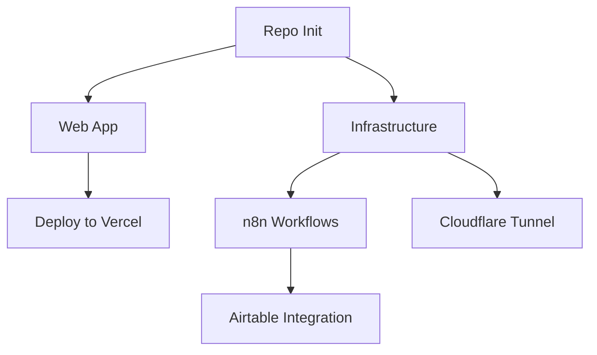

# Rensto Tasks Tracker

## Current Sprint Tasks

### 🟢 Completed

- [x] BMAD planning documents created
- [x] Repository structure initialized
- [x] Root documentation files added

### 🟡 In Progress

- [ ] Web application scaffold
- [ ] Infrastructure configuration
- [ ] n8n workflow setup

### 🔴 Pending

- [ ] Deploy to Vercel
- [ ] Configure Cloudflare Tunnel
- [ ] Set up Airtable integration
- [ ] Enable monitoring

## Task Details

### TASK-20240106-001: Initialize Repository
**Status**: ✅ Complete  
**Owner**: System  
**Description**: Set up base repository structure with config files  
**Deliverables**:
- .editorconfig
- .gitignore
- README.md
- SECURITY.md
- CONTEXT.md

### TASK-20240106-002: Create Web Application
**Status**: 🚧 In Progress  
**Owner**: System  
**Description**: Build Next.js marketing site with all pages  
**Deliverables**:
- Next.js 14 app structure
- All pages (Home, Offers, Process, Contact, Legal)
- Tailwind + shadcn/ui styling
- GSAP animations
- SEO optimization

### TASK-20240106-003: Infrastructure Setup
**Status**: 📋 Planned  
**Owner**: System  
**Description**: Configure Docker services and backup scripts  
**Deliverables**:
- docker-compose.yml
- Cloudflare Tunnel config
- Backup automation
- Environment examples

### TASK-20240106-004: n8n Workflows
**Status**: 📋 Planned  
**Owner**: System  
**Description**: Create and validate automation workflows  
**Deliverables**:
- 5 core workflows
- Validation tests
- Documentation

### TASK-20240106-005: Documentation
**Status**: 📋 Planned  
**Owner**: System  
**Description**: Complete all runbooks and guides  
**Deliverables**:
- Infrastructure runbook
- Deployment guide
- DNS setup docs
- Migration guide
- Onboarding checklist

## Upcoming Tasks

### Next Sprint
- [ ] Client portal foundation
- [ ] Advanced monitoring setup
- [ ] Performance optimization
- [ ] Security hardening

### Backlog
- [ ] AI content generation templates
- [ ] Multi-tenant support
- [ ] API rate limit management
- [ ] Advanced analytics dashboard

## Task Dependencies

## Sprint Velocity

| Sprint | Planned | Completed | Velocity |
|--------|---------|-----------|----------|
| Current | 5 | 1 | 20% |

## Blockers

None currently identified.

## Notes

- All tasks follow BMAD methodology
- Acceptance criteria defined in `/ops/spec.md`
- Gates must pass before marking complete
- Documentation required for all deliverables

---

*Last updated: 2024-01-06*
